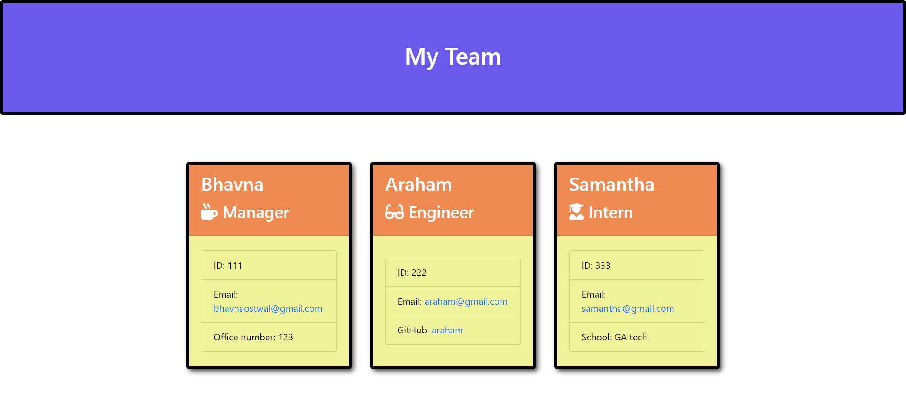

# Team-profile-Generator

## Description
Team profile generator is a node command line application that takes  information about employees using the Inquirer package and generates an HTML webpage that displays full team information.
## User Story
AS A manager
I WANT to generate a webpage that displays my team's basic info
SO THAT I have quick access to their emails and GitHub profiles

## Expected Goals

* WHEN I am prompted for my team members and their information
THEN an HTML file is generated that displays a nicely formatted team roster based on user input
* WHEN I click on an email address in the HTML
THEN my default email program opens and populates the TO field of the email with the address.
* WHEN I click on the GitHub username
THEN that GitHub profile opens in a new tab.
* WHEN I start the application
THEN I am prompted to enter the team manager’s name, employee ID, email address, and office number.
* WHEN I enter the team manager’s name, employee ID, email address, and office number
THEN I am presented with a menu with the option to add an engineer or an intern or to finish building my team.
* WHEN I select the engineer option
THEN I am prompted to enter the engineer’s name, ID, email, and GitHub username, and I am taken back to the menu.
* WHEN I select the intern option
THEN I am prompted to enter the intern’s name, ID, email, and school, and I am taken back to the menu.
* WHEN I decide to finish building my team
THEN I exit the application, and the HTML is generated.

## Steps Taken

* This is a node command line application which takes the user input using inquirer npm package. On the basis of questions a web page is created dynamically with the team members information displayed on cards.

* Since testing is an important part of the code development, JEST npm package is used to test the various functionality of the code.

## Installation

* Run npm i to install the node dependencies for the code.
* Run npm run test to run all the tests to see if they pass or fail.
* Run node index.js to generate the html and open that file in the browser.

## Screenshot

## Github Repo Link
https://github.com/bhavnao/Team-profile-Generator
## Demo Video Link
https://drive.google.com/file/d/19OfT53FDso4tNFjK-W3kS2VO-b1HK7RR/view

